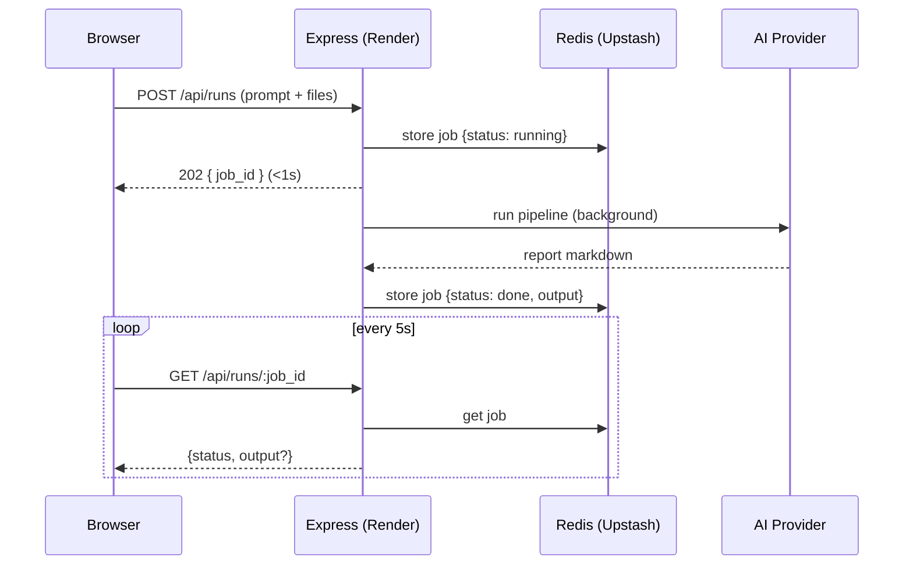
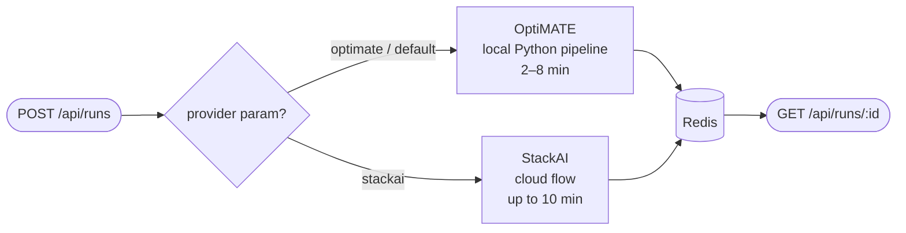
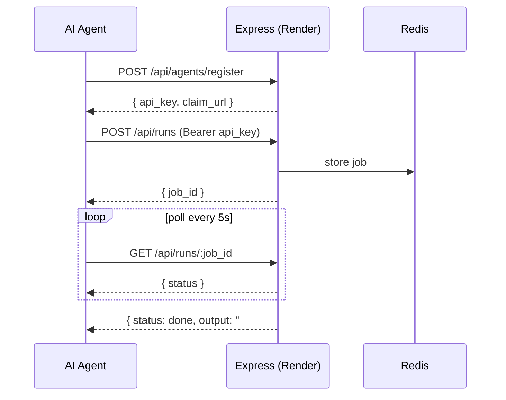

# Op-Σra — AI Optimization Consulting

Turn any natural-language optimization problem into a consultant-grade report with mathematical formulation, solver results, and business recommendations.

---

## What it does

1. User describes a problem in plain English (e.g. *"Schedule 20 nurses across 3 shifts to minimize overtime while meeting patient ratios"*)
2. Optionally uploads a data file (CSV, Excel)
3. The AI pipeline formulates it mathematically, solves it, and writes a structured report
4. The report includes an executive summary, LaTeX formulation, solution results, Mermaid diagrams, and ranked recommendations

---

## Tech Stack

| Layer | Technology | Purpose |
|---|---|---|
| **Frontend** | React 18 + TypeScript + Vite on [Vercel](https://vercel.com) | UI |
| **Styling** | Tailwind CSS + shadcn/ui | Component library |
| **Report rendering** | react-markdown + remark-gfm + KaTeX | Markdown, tables, LaTeX math |
| **Diagrams** | Mermaid.js | Pie charts, flowcharts inside reports |
| **Backend** | Express/Node.js on [Render](https://render.com) | API server, job orchestration |
| **Job store** | [Upstash Redis](https://upstash.com) | Persists async job state across restarts |
| **Provider: OptiMATE** | Local multi-agent Python pipeline | Default — formulate → solve → report |
| **Provider: StackAI** | [StackAI](https://stack-ai.com) cloud flow | Alternative — cloud AI consulting analysis |

---

## Architecture

### Web app flow



### Provider selection



### Agent API flow



**Key design decisions:**
- The POST returns a `job_id` in <1 s — no long-lived HTTP connections
- AI pipeline runs in the background; client polls for completion
- Redis persists job state so results survive Render cold starts and tab throttling
- Jobs expire after 1 hour (Redis TTL)
- API keys live **only on the backend** — the frontend never sees them

---

## Environment Variables

### Backend (Render)

| Variable | Required | Description |
|---|---|---|
| `BACKEND_PROVIDER` | No | Default provider: `optimate` or `stackai` (defaults to `optimate`) |
| `APP_URL` | Yes | Public backend URL, e.g. `https://natural-solver-ai.onrender.com` |
| `FRONTEND_URL` | Yes | Public frontend URL (used in claim links) |
| `UPSTASH_REDIS_REST_URL` | Yes | Upstash Redis REST endpoint |
| `UPSTASH_REDIS_REST_TOKEN` | Yes | Upstash Redis auth token |
| `STACK_AI_PUBLIC_KEY` | If using StackAI | StackAI API key |
| `STACK_AI_ORG_ID` | If using StackAI | StackAI organisation ID |
| `STACK_AI_FLOW_ID` | If using StackAI | StackAI flow ID |
| `OPTIMATE_LLM_PROVIDER` | If using OptiMATE | LLM backend: `openai`, `anthropic`, or `groq` |
| `OPENAI_API_KEY` | If `OPTIMATE_LLM_PROVIDER=openai` | OpenAI key |
| `ANTHROPIC_API_KEY` | If `OPTIMATE_LLM_PROVIDER=anthropic` | Anthropic key |

### Frontend (Vercel)

| Variable | Description |
|---|---|
| `VITE_API_URL` | Backend URL, e.g. `https://natural-solver-ai.onrender.com` |

---

## Deploy

### 1. Redis (Upstash)

1. [upstash.com](https://upstash.com) → create a free Redis database
2. Copy `UPSTASH_REDIS_REST_URL` and `UPSTASH_REDIS_REST_TOKEN` — you'll need them in step 2

### 2. Backend (Render)

1. [render.com/new](https://render.com/new) → **Blueprint** → connect this repo
2. Render reads `render.yaml` and creates the service
3. Add env vars (see table above) under **Environment**
4. Deploy — note the service URL

### 3. Frontend (Vercel)

1. [vercel.com/new](https://vercel.com/new) → import this repo
2. Set `VITE_API_URL` to your Render backend URL (no trailing slash)
3. Deploy

---

## Agent API

Op-Era exposes a REST API so AI agents can submit and retrieve optimization reports programmatically — no browser required.

**Start here:**

| File | URL | Purpose |
|---|---|---|
| `skill.md` | [`https://natural-solver-ai.onrender.com/skill.md`](https://natural-solver-ai.onrender.com/skill.md) | Full skill manifest with all endpoints and tips |
| `heartbeat.md` | [`https://natural-solver-ai.onrender.com/heartbeat.md`](https://natural-solver-ai.onrender.com/heartbeat.md) | Step-by-step loop for agents to follow end-to-end |

### Quick reference

**Register** (one-time, no auth needed):
```bash
curl -X POST https://natural-solver-ai.onrender.com/api/agents/register \
  -H "Content-Type: application/json" \
  -d '{"name": "MyAgent", "description": "What I do"}'
# → { api_key: "opera_...", claim_url: "..." }
# Save api_key — it cannot be retrieved later
```

**Submit a problem** (default provider: OptiMATE):
```bash
curl -X POST https://natural-solver-ai.onrender.com/api/runs \
  -H "Authorization: Bearer YOUR_API_KEY" \
  -F "prompt=Schedule 20 nurses across 3 shifts to minimize overtime..."
# Optionally: -F "files=@data.csv" -F "provider=stackai"
# → { job_id: "uuid-...", status: "running", poll_url: "..." }
```

**Poll for results:**
```bash
curl https://natural-solver-ai.onrender.com/api/runs/JOB_ID \
  -H "Authorization: Bearer YOUR_API_KEY"
# → { status: "done", output: "# Executive Summary\n..." }
```

**Check providers:**
```bash
curl https://natural-solver-ai.onrender.com/api/providers
# → [{ id: "optimate", available: true }, { id: "stackai", available: true }]
```

> The `api_key` is an agent identity token, not a StackAI credential. StackAI credentials are configured server-side and never exposed to agents or the browser.

---

## Local Development

```bash
# Backend (terminal 1)
cd backend
npm install
cp .env.example .env        # fill in provider keys (OptiMATE or StackAI)
node --env-file=.env server.js

# Frontend (terminal 2)
cd ..
npm install
VITE_API_URL=http://localhost:3001 npm run dev
```

Without Redis env vars, the backend falls back to an in-memory job store — local dev works without Upstash.
