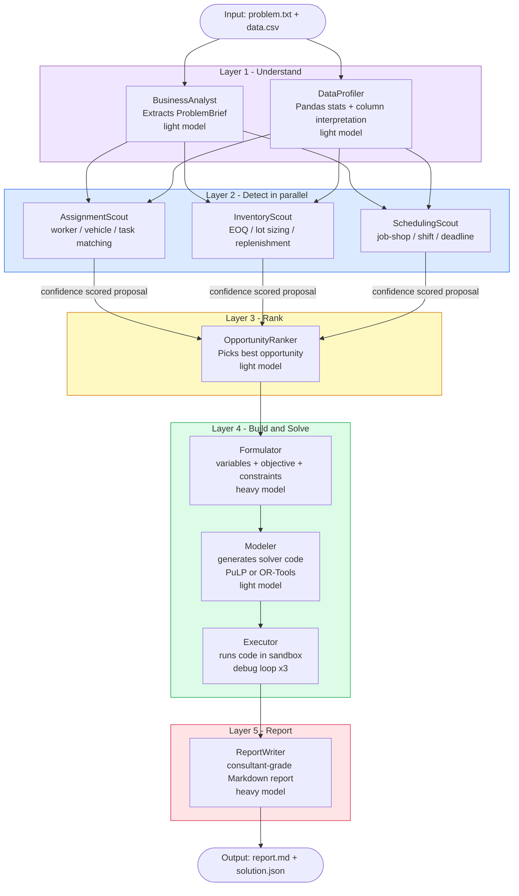

# OptiMATE v1-light

An autonomous Operations Research consulting pipeline. Give it a plain-English business problem and raw data — it profiles the data, detects the optimization opportunity, formulates the math, writes and runs solver code, debugs it if it fails, and delivers a polished Markdown report. No human in the loop.

---

## Agentic System



### Models used

| Layer | Agent(s) | Model tier | OpenAI default |
|-------|----------|-----------|----------------|
| Understand | BusinessAnalyst, DataProfiler | Light | `gpt-4o-mini` |
| Detect | AssignmentScout, InventoryScout, SchedulingScout | Light | `gpt-4o-mini` |
| Rank | OpportunityRanker | Light | `gpt-4o-mini` |
| Build | Formulator | **Heavy** | `gpt-4o` |
| Build | Modeler | Light | `gpt-4o-mini` |
| Report | ReportWriter | **Heavy** | `gpt-4o` |

Solvers: **PuLP/CBC** (assignment, inventory) · **OR-Tools CP-SAT** (scheduling)

---

## Setup

```bash
cd OptiMATE-v1-light
python3 -m venv venv
source venv/bin/activate
pip install -r requirements.txt
```

Add your OpenAI key to `.env`:

```
LLM_PROVIDER=openai
OPENAI_API_KEY=sk-...
```

---

## How to Run

### Run the full pipeline

```bash
python cli.py run \
  --input examples/sample_problem.txt \
  --data examples/sample_data.csv \
  --provider openai
```

With multiple data files:

```bash
python cli.py run \
  --input problem.txt \
  --data file1.csv \
  --data file2.csv \
  --provider openai
```

With a custom run ID:

```bash
python cli.py run \
  --input problem.txt \
  --data data.csv \
  --run-id my_run_001 \
  --provider openai
```

Output lands in `artifacts/{run_id}/`:
- `report.md` — consultant Markdown report
- `solution_output.json` — objective value, decision variables
- `generated_code.py` — solver code that was executed

### Check run status

```bash
python cli.py status <run_id>
```

### Run tests

```bash
pytest tests/
```

---

## Project Structure

```
OptiMATE-v1-light/
├── cli.py                        Entry point
├── .env                          API keys (gitignored)
├── examples/
│   ├── sample_problem.txt        Example logistics problem
│   └── sample_data.csv           8 drivers × 12 routes cost matrix
├── optimatecore/
│   ├── orchestrator.py           Pipeline runner
│   ├── base_agent.py             Shared LLM call + retry logic
│   ├── llm_client.py             Anthropic / OpenAI / Groq adapters
│   ├── artifact_store.py         Atomic file store per run
│   ├── sandbox.py                Resource-limited subprocess
│   ├── agents/                   All agents (see diagram above)
│   │   └── scouts/               Parallel opportunity detectors
│   ├── schemas/                  Pydantic contracts between agents
│   └── solvers/                  PuLP + OR-Tools templates
└── artifacts/                    Runtime output (gitignored)
```
